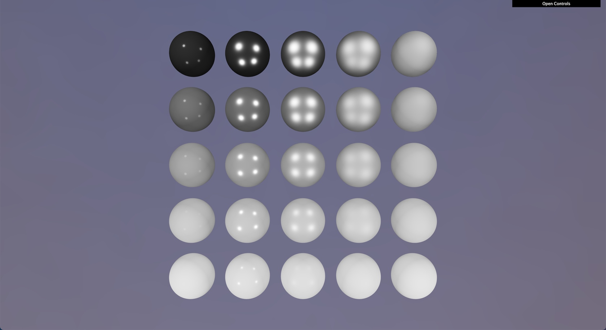
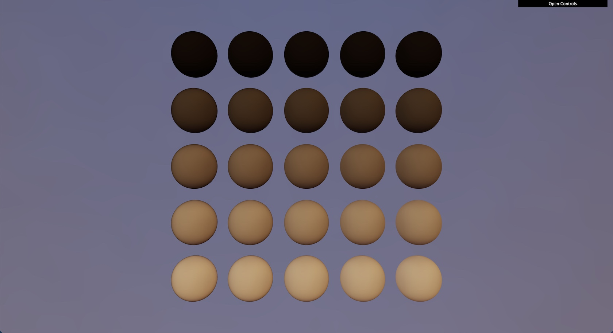
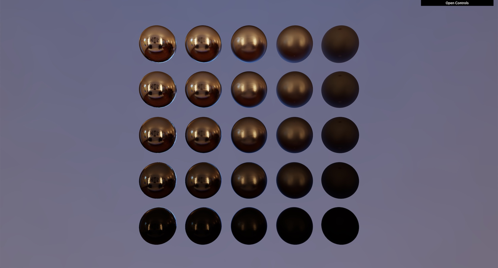
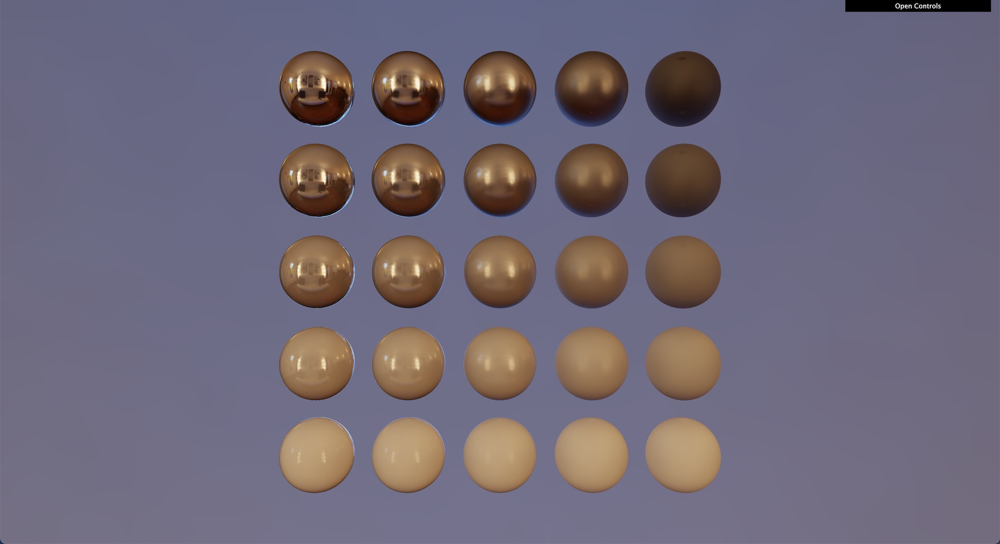

# Physically Based Rendering (PBR)

The goal of this project is to implement a PBR renderer. You are asked to implement:
* A Lambertian diffuse BRDF
* A Cook-Torrance GGX specular BRDF

To learn about:
* The subject, please reach the [Assignment](#assignment)
* The provided code, please have a look at the [Provided Code section](#provided-code).


## Installation

After cloning the repository, install dependencies using:

```sh
yarn # Alternatively you can run `npm install`
```

## Running

You can start the development server using:

```sh
yarn dev # Alternatively you can run `npm run dev`
```

You can now reach [localhost:8080](http://localhost:8080) to try your code.
The development server supports Hot-Reload, which means that when saving your code, the page
will automatically auto-reload with the latest changes.

## Tooling

* [Spector.js](https://chrome.google.com/webstore/detail/spectorjs/denbgaamihkadbghdceggmchnflmhpmk?hl=en): Chrome extensions
  that will help you analyze data sent to webgl, visualize framebuffers, etc...
  The best debugging tool for WebGL!

## Assignment

### 1. Ponctual Lights

> By `Poncutual Lights`, I mean directional lights or point ligts.

You are free to proceed the way you want. However, I would advise you to
go step by step and to check intermediate results.

This is the steps I followed when implementing this subject, and I do recommend it
to ensure every intermediate result is correct:

1. Draw a basic sphere with a simple color
2. Draw geometric properties, such as the `normal`, the `viewDirection` etc...
3. Send simple light data to the shader, and display them
4. Implement the Lambertian diffuse BRDF
5. Implement the Cook-Torrance GGX specular BRDF

It's important to ensure intermediate results are correct. Otherwise, you will spend time
trying to figure out why your specular is off, when the issue might actually comes from a different part of the pipeline.

This is the kind of results you should get with 4 point lights:


### 2. Image-Based Lighting (IBL): Diffuse

The tasks to accomplish to lit your objects with the diffuse IBL are:
1. Load one of the  `diffuse` files provied in the folder `assets/env`
2. Use the geometry normal to sample the texture. Be careful here, the texture
   is saved as a spherical projection. Thus, you will need to convert from cartesian
   coordinates to polar coordinates
4. Apply the texture contribution to the indirect lighting

This is the kind of results you should get with the diffuse texture `Alexs_Apt_2k-diffuse-RGBM.png`:


### 3. Image-Based Lighting (IBL): Specular

For the specular IBL, the texture encodes different version of the environment
for different roughness value. There is a total of **6** roughness levels, starting
at the bottom of the texture.

Each level is then half the size of the previous level. Thus, you will need to
compute the good position of the UV from the roughness value.

In order to get proper blending, you are advised to sample two roughness levels
simultaneously, and to blend them together.

The tasks to accomplish to lit your objects with the specular IBL are:
1. Load one of the  `specular` files provied in the folder `assets/env`
2. Convert the reflected ray from cartesian to polar
3. Offset the polar coordinates according to the roughness level
4. Repeat step **2** and **3** for a second level
5. Fetch both levels and blend them together according to how far between the two the sample was

This is the kind of results you should get with the diffuse texture `Alexs_Apt_2k-specular-RGBM.png`:


Now that you implemented both the diffuse and the specular IBL, you can see the combined result of both:



## Going Further

The feature described here aren't mandatory but will make you learn a lot of stuff!

### 1. Textures

PBR is meaningless without carefully authored textures bringing complexity to materials.

Load the **roughness**, **metalness**, **albedo**, and **normal map**, and use the textures
to feed the BRDF.

### 2. Experiment BRDFs

There are a lot of other BRDFs, whether it is for the diffuse component or the specular one.
Try to experiment with some of them and compare how they look. You can try any BRDFs you want,
such that the Burley diffuse.

### 3. Image-Based Lighting

#### Diffuse

For this project, you have worked with pre-convolved diffuse data. Instead of using
the asset in the repository, try to generate yourself the convolved diffuse of an
environment texture.

#### Specular

Just like you did for the diffuse, you can generate the specular probe. This task is harder,
but will definitely make you stronger.

### 2. Anything you can think of...

There are so many fun things you can do:
* Loading more complex models
* Add several light probe with blending
* ...

## Provided Code

### Index

The [index](./src/index.ts) is the entry point of your application. The game loop is started there
and resources are initialized in the `Application` class.

In this repository, I created a simple shader that sets a uniform color on a triangle. This sample
will help you start to implement your PBR shader.

### Context

The [context](./src/gl.ts) is one of the most important. It abstracts WebGL calls and resources management.
Without that, you would need to spend quite a bit of code to setup:
* Geometries (Vertex Buffers)
* Textures
* Shaders
* etc...

I didn't you to spend your time writing an abstraction, so I made one for you. If you want fancier features, please
feel free to update it with your own changes.

For the most curious ones, the file uses `WeakMap` (basically hash tables) to retrieve uploaded GL objects
from your own instances (textures, geometries, etc...).

### Shader

The [Shader](./src/shader/shader.ts) just contains the two shaders (vertex and fragment) as strings.
It also contains a dictionnary (`defines`) that can allow you to conditionnally compile code or not.

When working on big rendering project, we often want several versions of a same shader with some differences.
Using `#define`, we take advantage of the preproccessor to compile different variants.

The values in the `defines` dictionnary will basically be preprended too your shader before compiling it.
